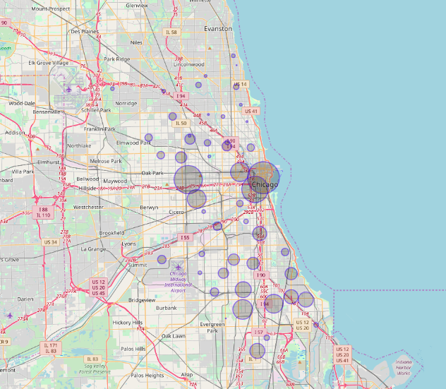

Analysing crimes record in Chicago with Scala and Spark
========

#### Data 
https://data.cityofchicago.org/Public-Safety/Crimes-2001-to-present/ijzp-q8t2/data

### Example
##### Plot a geographic chart to demonstrate the danger degree in each ward on the map of Chicago City
